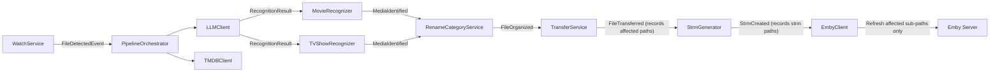

# High Level Requirement

I want to build a tool which can help me to manager and organize my media files. This tool should be able to monitor new incoming files, recoganize them by LLM and TMDB, and organize them into right folders with better file names, and then with an option to generate strm files and inform emby server to scan new strm files.

# Background

1. I have a cloud storage named 115 Cloud, where I store media files there, including movie and tv shows.
2. I use CloudDrive2 to mount 115 Cloud to my local disk.
3. I usally get new media files by 115 share links and save new media files into 115 folder like 'My recieved'
4. For playing, I generate strm files and then use emby to scan strm files for building media libraries.

# Technology Stack

- **Language**: Python 3.11+
- **Backend framework**: FastAPI
- **Frontend**: Web-based UI, Vue 3
- **Database**: SQLite
- **Task scheduling**: APScheduler
- **Containerization**: Docker
- **Package management**: pip + requirements.txt
- **CloudDrive2 client**: [clouddrive2-client](https://pypi.org/project/clouddrive2-client) — Python library for file operations using cd2 grpc, faster than operate the locally mounted filesystem
- **Watchfiles**: https://pypi.org/project/watchfiles/ - clouddrive2-client or the underlying CloudDrive2 API does not support subscribing to file change events, so we use watchfiles to watch on the mounted point.

# Use Case Example

## Folder structure (incoming)

```
/root/
    /my recieved/
        Test movie1.web-dl.2160p.AAC.mp4
        Test movie1.web-dl.2160p.AAC.srt
        Test movie2.REMUX.1080p.DTS.mkv
        Test movie2.REMUX.1080p.DTS.chs.srt
        Test movie2.REMUX.1080p.DTS.eng.srt
        Test movie3.UHD.HEVC.2160p.TrueHD7.1.iso
        /Test tv show1/
            episode1.mkv
            episode1.chs.srt
            episode2.mkv
        /Test tv show2/
            S01
                test-episode1.S01E01.mkv
                test-episode2.S01E02.mkv
            S02
                1.mp4
                2.mp4
        /Test movie4/
            Test movie4.UHD.disc1.iso
            Test movie4.UHD.disc2.iso
```

## Expectations

The app should be able to correclty distinguish movie and tv shows, and then rely on the foler name/file name, it can recoganize the media using LLM model and TMDB api. Based on tmdb result, it can reorganize the media files into a well-structured folder like:

```
/root/
    /my organized/
        /Web-DL Movies/
            /Test movie1 (2009) {tmdb-123456}/
                Test movie1.mp4
                Test movie1.srt
        /REMUX Movies/
            /Test Movie2 (2022) {tmdb-234555}/
                Test movie2.mkv
                Test movie2.srt
        /ISO Movies/
            /Test movie3 (2025) {tmdb-777777}/
                Test movie3.iso
            /Test movie4 (2026) {tmdb-988888}/
                Test movie4.disc1.iso
                Test movie4.disc2.iso
        /Chinese TV Shows/
            /Test tv show1 (2002) {tmdb-222222}/
                /Season 1/
                    Test tv show1 - S01E01 - episode title.mkv
                    Test tv show1 - S01E01 - episode title.srt
                    Test tv show1 - S01E02 - episode title.mkv
        /Europe TV Shows/
            /Test tv show2 (2005) {tmdb-5555555}/
                /Season 1/
                    Test tv show2 - S01E01 - episode title.mkv
                    Test tv show2 - S01E02 - episode title.mkv
                /Season 2/
                    Test tv show2 - S02E01 - episode title.mp4
                    Test tv show2 - S02E02 - episode title.mp4
```

## File Type Definitions

All file type lists are **user-configurable** in the config file.

### Video Files

Extensions recognized as video files. These are the primary files that drive media detection, recognition, and strm generation.

Default: `.mkv`, `.mp4`, `.avi`, `.iso`, `.ts`, `.m2ts`, `.wmv`, `.flv`, `.rmvb`, `.mov`

### Subtitle Files

Extensions recognized as subtitle files. During organize and transfer, subtitles are **moved and renamed to match the video file** (no language suffix in the output filename).

Default: `.srt`, `.ass`, `.ssa`, `.sub`, `.sup`, `.idx`

**Subtitle deduplication:** For each subtitle format (e.g. `.srt`, `.ass`, `.sup`), only **one file** is kept:
- If a Chinese subtitle (identified by `chs`, `cht`, `chinese`, `zh` in the original filename) exists, prefer it.
- Otherwise, select one arbitrarily.

Different formats can coexist -- e.g. keeping one `.ass` and one `.sup` is fine, but not two `.ass` files.

Example: source has `movie.chs.srt`, `movie.eng.srt`, `movie.chs.ass` -> output: `Title.srt` (the Chinese one), `Title.ass` (the Chinese one).

### Other Companion Files

All other companion file extensions. During organize and transfer, these are **moved along with the video file but keep their original filename**.

Default: `.nfo`, `.jpg`, `.png`, `.bmp`, `.txt`

### Handling Rules Summary

| Step | Video files | Subtitle files | Other companion files |
|------|------------|----------------|----------------------|
| **Organize** | Move and rename per naming rules | Move and rename to match video file | Move with video, keep original name |
| **Transfer** | Move to library | Move to library, renamed to match video | Move to library, keep original name |
| **strm generation** | Generate `.strm` file | **Copy** to strm output folder | **Copy** to strm output folder |

During strm generation, only video files produce `.strm` files. All other files (subtitles and companion files) are **copied** into the strm output folder alongside the `.strm` file, so Emby can find them.

# Detail Requirements

## Typical Process Flow

```
watch -> recognize media -> rename and organize -> transfer to library -> generate strm files -> inform emby server
```

1. The app starts and watches for changes on local mounted folders (based on configuration).
2. When new changes arrive (by polling observer), the app reads the folder structure and then calls the LLM model and TMDB API to recognize media.
3. **High confidence matches** (see Confidence and Review section below): the app automatically renames files (by configured naming rules) and organizes them into proper folders.
4. **Low confidence matches** and **Unrecognized files**: the app moved them into a unrecoganized folder and queues them for user review. The user can confirm, correct, or skip via the UI. 
5. Based on user action or predefined scheduler, the app transfers organized files into formal media library folders and generates strm files accordingly. During this step, the app **records all affected paths** (both physical library paths and strm output paths).
6. The app then calls the Emby API to refresh **only the specific sub-paths** that were touched -- if strm files were generated, it refreshes the strm library paths; if only physical files were transferred, it refreshes those library paths. This avoids full-library scans. (Optional, as the Emby server can also monitor file changes.)

## Manual Process Flow

The manual pipeline is a separate, on-demand operation -- not tied to any configured task. The user navigates to the Manual Pipeline page and follows a guided flow:

1. **Select source folder** -- browse CloudDrive2 folders and pick the folder to process.
2. **Review and select items** -- the app lists detected items with auto-classified media types. The user selects which items to process and can override media type if needed.
3. **Configure run** -- choose target organized folder. Optionally enable auto-transfer, strm generation, and Emby refresh. Naming, category, and transfer rules are global -- no rule selection needed.
4. **Process** -- the pipeline runs on selected items. Recognition results appear inline; low-confidence items can be resolved on the spot. After organize, the user can review results before confirming transfer. 

This creates no persistent task. All file operations are still recorded in the database for audit.

## Confidence and User Review

Recognition results fall into two tiers:

| Tier | Condition | Action |
|------|-----------|--------|
| **High confidence** | LLM extracts a clear title + year, TMDB returns a single strong match (refer the project AIGUA and AIGUA.tv) | Auto-process without user intervention |
| **Low confidence** and **Unrecognized** | TMDB returns multiple candidates, or LLM extraction is ambiguous (e.g. generic title, missing year) |  Move to "unmatched" folder, log for manual handling |

**Important notice**
I already implement complex and detail recoganizing logic in refer project AIGUA and AIGUA.tv. When creating this new app, I expect to copy the exact implementation from there. Of couse we can change the code architecture to meet our new project, but the core logic should be kept. This should be done very carefully as the reference projects have covered a lot of edge cases - I don't want to fix issues for these case again after migration.

## File Operation Semantics

### Move

- **Organize step** (incoming -> organized): **Move** files via CloudDrive2 gRPC (rename/move within the same 115 Cloud storage, which is fast and doesn't consume bandwidth).
- **Transfer step** (organized -> library): **Move** files via CloudDrive2 gRPC (rename/move within the same 115 Cloud storage, which is fast and doesn't consume bandwidth).

### Overwrite Behavior

Overwrite mode is configured per task (see Tasks config section). Two modes:
- **`replace_folder`** (default) -- follows the addlib logic: always replaces the entire movie folder or season folder as one unit.
- **`append_episode`** -- for TV shows, moves and overwrites episode files one by one without deleting the existing season folder, preserving episodes already there. For movies, behaves the same as `replace_folder`.

### Source Cleanup

- After successful organize: source folder entry is removed (since it was a move).
- After successful transfer: organized folder entry is removed 

### Rollback

- Before any batch operation, the app logs the planned file moves to the database.
- If an error occurs mid-batch, already-moved files are logged so the user can manually revert based on the log

## Media Detection

### Determination of Movie vs TV Show

Items in the source folder ("my received") come in two forms:
1. **Standalone video files** -- a single file sitting directly in the source folder
2. **Subfolders** -- a folder containing one or more video files, possibly with sub-subfolders

Detection is purely based on **video file count** within the item, with a disc/part check for the two-file edge case. No LLM call is needed for this step.

**Standalone video files** (sitting directly in the source folder, no subfolder):
- Always classified as **movie**.

**Subfolders** -- count all video files recursively (across any sub-subfolders like season folders):

| Video File Count | Rule | Classification |
|-----------------|------|---------------|
| 1 | Single file in folder | **Movie** |
| 2 | Check if filenames contain disc/part patterns | Disc/part found → **Movie** (multi-disc); otherwise → **TV show** |
| 3+ | Multiple files | **TV show** |

**Disc/part filename patterns** (case-insensitive):
- `disc1`, `disc2`, `disk1`, `disk2`
- `CD1`, `CD2`
- `part1`, `part2`, `pt1`, `pt2`

This works because a movie realistically has at most 2 discs. Three or more video files in a folder is always episodes.

### Season and Episode Patterns

The recognizer handles patterns like:

| Pattern | Example | Detected As |
|---------|---------|-------------|
| `S01E01` | `show.S01E01.mkv` | Season 1, Episode 1 |
| `S01E01-E03` | `show.S01E01-E03.mkv` | Season 1, Episodes 1-3 (multi-episode) |
| Season folder + bare number | `S02/1.mp4` | Season 2, Episode 1 (inferred from folder + filename order) |
| No season info | `episode1.mkv` inside `/Show Name/` | Season 1 assumed, episode number extracted |
| Absolute numbering | `Show - 25.mkv` | Map to season/episode via TMDB |

And there will be a lot of edge cases like below:

- **Bare numeric filenames** (`1.mp4`, `2.mp4`): episode number inferred from filename, season inferred from parent folder name (e.g. `S02/` -> Season 2).
- **No season folder, no season in filename**: default to Season 1.
- **Specials / SP / OVA / extras**: Organize into a "Specials" or "Season 0" folder
- **Multi-episode files** (`S01E01-E03`): keep as single file.

As I said, most cases are already covered in the reference project aigua.tv. We should respect the implementation as much as possible from there, until you find a new edge case.

## Category Classification

Categories determine which top-level folder a media item is organized into. Categories are **user-definable** via configuration rules.

### Classification Approach

Each category rule defines both classification (which items belong here) and transfer destination (where they go in the library).

Categories are defined in YAML, grouped under `movie` and `tv` sections. The **key** is the category name (used as the organized subfolder name). Categories are matched **in order** -- the first matching category wins, so no explicit priority field is needed. A category with no conditions acts as a fallback.

**Match conditions** (all conditions on a category must match; multiple values within one condition use OR logic):
- `filename_keywords`: comma-separated keywords to match in the original filename (e.g. `remux`, `web-dl,webdl`)
- `origin_country`: comma-separated country codes from TMDB (e.g. `CN,TW,HK`)
- `genre_ids`: comma-separated TMDB genre IDs (e.g. `16` for animation)
- `original_language`: comma-separated language codes (e.g. `zh`, `ja`)
- `file_extension`: comma-separated extensions (e.g. `.iso`)
- Exclusions: prefix with `!` (e.g. `!CN` to exclude China)

**Transfer attributes** on each category:
- `library_path`: absolute path to the target library folder (different categories can point to different roots)
- `organize_by_initial`: whether to create A-Z / 0-9 subfolders under the library folder

Refer to [aigua.tv category.yaml](https://github.com/narapeka/aigua.tv/blob/main/category.yaml) for the condition syntax design.

### Example Category Rules

```yaml
# Movie categories -- matched in order, first match wins
movie:
  REMUX:
    filename_keywords: 'remux'
    library_path: '/mnt/115/library/REMUX'
    organize_by_initial: true

  Web-DL:
    filename_keywords: 'web-dl,webdl'
    library_path: '/mnt/115/library/Web-DL'
    organize_by_initial: true

  ISO:
    file_extension: '.iso'
    library_path: '/mnt/115/library/ISO'
    organize_by_initial: true

  # Fallback for movies that match no category above
  其他电影:
    library_path: '/mnt/115/library/其他电影'
    organize_by_initial: true

# TV show categories -- matched in order, first match wins
tv:
  国漫:
    genre_ids: '16'
    origin_country: 'CN,TW,HK'
    library_path: '/mnt/115/library/国漫'
    organize_by_initial: false

  日番:
    genre_ids: '16'
    origin_country: 'JP,KR'
    library_path: '/mnt/115/library/日番'
    organize_by_initial: false

  华语剧:
    origin_country: 'CN,TW,HK'
    library_path: '/mnt/115/library/国产剧'
    organize_by_initial: true

  日韩剧:
    origin_country: 'JP,KR,TH,SG,MY,PH,VN,ID'
    library_path: '/mnt/115/library/日韩剧'
    organize_by_initial: true

  欧美剧:
    origin_country: 'US,GB,CA,AU,NZ,FR,DE,ES,IT,NL,PT,PL,SE,NO,DK,FI'
    library_path: '/mnt/115/library/欧美剧'
    organize_by_initial: true

  # Fallback for TV shows that match no category above
  未分类:
    library_path: '/mnt/115/library/未分类'
    organize_by_initial: false
```

During transfer, the app reads each item's matched category, looks up `library_path` and `organize_by_initial`, and moves the item to `<library_path>/[A-Z]/<item>` accordingly. Overwrite behavior comes from the task configuration.

## Configuration

All configuration is stored in a single config file (YAML) with the following sections:

### File Types

```yaml
file_types:
  video: ['.mkv', '.mp4', '.avi', '.iso', '.ts', '.m2ts', '.wmv', '.flv', '.rmvb', '.mov']
  subtitle: ['.srt', '.ass', '.ssa', '.sub', '.sup', '.idx']
  companion: ['.nfo', '.jpg', '.png', '.bmp', '.txt']
```

### CloudDrive2 gRPC

```yaml
clouddrive2:
  address: "192.168.1.100:19798"
  username: "user"
  password: "password"
```

### LLM

```yaml
llm:
  base_url: "https://api.openai.com/v1"
  api_key: "${LLM_API_KEY}"       # supports env var reference
  model: "gpt-4o-mini"
  batch_size: 10                   # number of files to send in one LLM call
  timeout: 30                      # seconds
  max_retries: 3
```

### TMDB

```yaml
tmdb:
  api_key: "${TMDB_API_KEY}"
  proxy: ""                        # optional HTTP proxy
  rate_limit: 40                   # requests per 10 seconds (TMDB default limit)
  language: "zh-CN"                # preferred language for metadata
```

### Naming Rules

```yaml
naming:
  movie_folder: "{title} ({year}) {{tmdb-{tmdb_id}}}"
  movie_file: "{title}.{ext}"
  tv_folder: "{title} ({year}) {{tmdb-{tmdb_id}}}"
  season_folder: "Season {season}"
  episode_file: "{title} - S{season:02d}E{episode:02d} - {episode_title}.{ext}"
```

### Category Rules

See the Category Classification section above. Defined in YAML with `movie` and `tv` groups, matched in order.

### Transfer

Transfer destination (library path, A-Z organization) is defined per category -- see the Category Classification section. Overwrite behavior is defined per task. There is no separate transfer configuration.

### strm Generation

```yaml
strm:
  enabled: true
  base_path: "/CloudDrive2/115"    # path prefix for strm file content
  output_path: "/strm_library"     # where strm files are written
  path_mapping:                    # optional: rewrite paths in strm content
    from: "/mnt/115"
    to: "/CloudDrive2/115"
```

### Emby

```yaml
emby:
  address: "http://192.168.1.100"
  port: 8096
  api_key: "${EMBY_API_KEY}"
  # alternative auth:
  # username: "admin"
  # password: "password"
  auto_refresh: true               # call refresh after transfer/strm generation
  libraries:                       # map Emby library IDs to their root paths
    - library_id: "abc123"
      name: "Movies"
      root_path: "/library/Movies"
    - library_id: "def456"
      name: "TV Shows"
      root_path: "/library/TV Shows"
    - library_id: "ghi789"
      name: "Strm Library"
      root_path: "/strm_library"
```

**Emby refresh strategy:**
- Refresh paths are **not** hardcoded. Instead, during transfer and strm generation, the app records all affected paths (e.g. `/library/REMUX Movies/Test Movie2 (2022) {tmdb-234555}/`).
- After the pipeline completes, the app collects these recorded paths, matches them to the corresponding Emby library, and calls the Emby API to refresh only those specific sub-paths -- not the entire library.
- If a task includes strm generation, the refresh targets the **strm output paths** (where Emby reads strm files), not the physical media library paths.
- If a task only transfers physical files without strm generation, the refresh targets the **physical library paths**.
- This avoids unnecessary full-library scans and makes refresh fast and targeted.

## Tasks

Tasks only define where to watch and when to act. Naming, category, and transfer rules are global -- no need to select them per task.


Tasks are stored in db and may contains following attributes:
    name: "Watch My Received"
    watch_folder: "/mnt/115/My recieved"
    organized_folder: "/mnt/115/organized"
    polling_interval: 300          # seconds
    auto_transfer: false           # if true, transfer immediately after organize
    transfer_schedule: "0 2 * * *" # an independent scheduled transfer that always runs regardless of auto_transfer
    overwrite: "replace_folder"    # replace_folder | append_episode
    strm_enabled: true             # generate strm files after transfer


**Overwrite modes:**
- `replace_folder` -- for movies, replaces the entire movie folder. For TV shows, replaces the entire season folder. This is the default, matching the addlib behavior.
- `append_episode` -- for TV shows, merges new episodes into existing season folders without deleting old episodes. For movies, behaves the same as `replace_folder`.

## User Interface

### Overview

The app provides a web-based UI accessible via browser. Since the app is primarily watch + auto-process, the UI is designed for **monitoring** first, with manual intervention as the exception. Tasks are the central entity the UI is organized around.

### Information Architecture

```
Dashboard                              (overview of all tasks)
Task Detail                            (per-task workspace)
├── Status & Activity Feed             (what happened recently)
├── Pending Review                     (items needing attention)
├── Organized Items                    (ready for transfer)
├── Pipeline Controls                  (transfer, strm, emby refresh)
├── Task Logs                          (logs scoped to this task)
└── Task Settings                      (source, target, rules, schedule)
Manual Pipeline                        (on-demand, one-shot processing)
├── Step 1: Select source folder       (browse CloudDrive2 folders)
├── Step 2: Review & select items      (preview folder content, pick items)
├── Step 3: Configure run              (organized folder, transfer/strm/Emby toggles)
└── Step 4: Process                    (run pipeline, review results)
Settings                               (global connections & credentials)
```

### Pages

#### Dashboard

Bird's-eye view across all tasks:
- List of tasks with status badges (watching / idle / processing / error)
- Count of items needing review per task (draws attention only when needed)
- Recent activity feed across all tasks (last N auto-processed items)
- Quick actions per task: start/stop, trigger scan, trigger transfer

#### Task Detail

The primary workspace. Each task is a self-contained pipeline, and its detail page shows everything related to it:

| Section | Content |
|---------|---------|
| **Status** | Current state (watching / idle / processing), last poll time, next scheduled transfer |
| **Activity Feed** | Chronological list of all pipeline events for this task: detected → recognized → organized → transferred → strm generated → Emby refreshed. Shows what the task has been doing without user intervention. |
| **Pending Review** | Items that failed auto-processing (low confidence or unrecognized). User can select TMDB candidates, manually input, or skip. Batch actions supported. This section is empty most of the time if recognition works well. |
| **Organized Items** | Files that have been recognized and organized but not yet transferred. Preview of what the next transfer will move. |
| **Pipeline Controls** | Manual triggers for each pipeline stage: transfer, strm generation, Emby refresh. Status and history for each. See details below. |
| **Task Logs** | Logs scoped to this task only. Filterable by level and time range. Each task has its own log stream so the user sees only what is relevant. |
| **Task Settings** | Watch folder, organized folder, polling interval, transfer schedule, strm/Emby toggles |

##### Pipeline Controls Detail

The task detail page surfaces controls for the post-organize stages, since these can run independently:

| Stage | Status Display | Manual Trigger |
|-------|---------------|----------------|
| **Transfer** | Last transfer time, file count, success/failure | "Transfer Now" button; transfers all organized items to library |
| **strm Generation** | Last generation time, strm file count | "Generate strm" button; generates strm files for all newly transferred items |
| **Emby Refresh** | Last refresh time, refreshed paths, success/failure | "Refresh Emby" button; sends affected paths to Emby for targeted scan |

When auto_transfer is enabled, these three stages run in sequence automatically after organize. The manual triggers are for cases where the user wants to run them independently or re-run a failed stage.

#### Manual Pipeline

A separate page for on-demand, one-shot processing of any folder. Unlike tasks (which are configured once and run continuously), the manual pipeline is a guided wizard flow for ad-hoc operations.

**Step 1 -- Select source folder:**
- Browse CloudDrive2 folders via a folder picker
- Select the folder to process

**Step 2 -- Review and select items:**
- The app lists all detected items in the folder (applying the movie/TV detection rules)
- Each item shows: file name, detected media type (movie/TV), file count, total size
- The user can select/deselect individual items, or select all
- The user can override the detected media type for any item if the auto-detection was wrong

**Step 3 -- Configure run:**
- Choose target organized folder (or use a default)
- Choose overwrite mode: `replace_folder` or `append_episode`
- Optionally enable: auto-transfer after organize, strm generation, Emby refresh
- The user can also choose to only organize without transferring (review organized results first)
- Naming and category rules are global -- no rule selection needed

**Step 4 -- Process:**
- The app runs the pipeline on the selected items
- Progress is shown in real-time (item by item)
- Recognition results are displayed inline; low-confidence items can be resolved on the spot
- After organize, the user can review the organized structure before confirming transfer
- Logs for this manual run are kept and viewable in the results summary

The manual pipeline creates no persistent task -- it is a fire-and-forget operation. However, all file operations and history are still recorded in the database for audit purposes.

#### Settings

Global configuration shared across all tasks. There is one set of rules for the entire app -- no per-task rule selection needed.

| Section | Content |
|---------|---------|
| **CloudDrive2** | gRPC address, username, password |
| **LLM** | API base URL, API key, model, batch size, timeout |
| **TMDB** | API key, proxy, rate limit, preferred language |
| **Emby** | Address, port, API key, library mappings |
| **Naming** | Global naming patterns for movies and TV shows |
| **Categories** | Global category list with match conditions, library path, A-Z (matched in order) |
| **strm** | Base path, output path, path mapping |

### Manual Actions Reference

Every user-triggerable action in the UI, organized by location:

#### Dashboard Actions

| Action | Description |
|--------|------------|
| Create task | Create a new task with source/target folders, schedule, and overwrite/strm/Emby toggles |
| Start / Stop task | Toggle watching on or off for a task |
| Trigger scan | Poll the source folder immediately instead of waiting for the next interval |
| Trigger transfer | Start transfer of all organized items for a task |

#### Task Detail -- Recognition & Review Actions

| Action | Description |
|--------|------------|
| Re-scan source | Re-poll the source folder and detect new items |
| Select TMDB match | Pick the correct TMDB candidate from the suggestion list |
| Search TMDB manually | Enter custom search terms to find the right TMDB entry |
| Input TMDB ID directly | Paste a known TMDB ID to force-match an item |
| Re-run recognition | Retry LLM + TMDB lookup for a failed or low-confidence item |
| Skip / dismiss item | Mark an item as skipped; it will not be processed |

#### Task Detail -- Organization Actions

| Action | Description |
|--------|------------|
| Rename item | Manually edit the organized file/folder name |
| Move item | Move back to source for reorganize or delete |

#### Task Detail -- Pipeline Actions

| Action | Description |
|--------|------------|
| Transfer now | Transfer all organized items to library folders |
| Transfer selected | Transfer only selected organized items |
| Generate strm | Generate strm files for all newly transferred items |
| Regenerate strm | Regenerate strm files for specific items (e.g. after path mapping change) |
| Refresh Emby | Send affected paths to Emby for targeted library scan |
| Refresh Emby (full) | Trigger a full Emby library scan (fallback) |

#### Task Detail -- Task Management Actions

| Action | Description |
|--------|------------|
| Edit task settings | Modify source/target folders, schedule, strm/Emby toggles |
| Delete task | Remove task |
| Enable / Disable task | Keep task configuration but stop all automatic processing |
| View task logs | Browse logs filtered to this task |
| Clear task logs | Remove old log entries for this task |

#### Manual Pipeline Actions

| Action | Description |
|--------|------------|
| Browse folders | Navigate CloudDrive2 folder tree to select a source folder |
| Select / deselect items | Pick specific items from the detected file list to process |
| Select all / Deselect all | Toggle selection of all items |
| Override media type | Change detected movie/TV classification for an item |
| Choose organized folder | Select target organized folder (or use default) |
| Toggle auto-transfer | Choose whether to transfer immediately after organize or review first |
| Toggle strm generation | Enable/disable strm generation for this run |
| Toggle Emby refresh | Enable/disable Emby refresh for this run |
| Process | Run the pipeline on selected items |
| Resolve low-confidence | During processing, confirm or correct recognition results inline |
| Review organized results | After organize, inspect the result before confirming transfer |
| Confirm transfer | After reviewing organized results, proceed with transfer |

#### Settings Actions

| Action | Description |
|--------|------------|
| Test CloudDrive2 connection | Verify gRPC connectivity and credentials |
| Test LLM connection | Send a test prompt to verify API key and model |
| Test TMDB API | Verify API key with a sample search |
| Test Emby connection | Verify API key and connectivity, list libraries |
| Edit naming patterns | Modify global naming templates for movies and TV shows |
| Edit category list | Add, edit, remove, reorder categories (including library path, A-Z per category) |
| Edit strm settings | Modify base path, output path, path mapping |

### Design Principles

- The dashboard should feel like a **calm monitoring panel** -- green/normal when everything is auto-processing, drawing attention only when items need review.
- Task detail page is the main workspace, but the user should rarely need to visit it if things are running smoothly.
- The pending review section should surface only when there are actual items, not as an always-visible empty queue.
- Each task has its own log stream. There is no global log page -- logs are always viewed in the context of the task that produced them.
- UI design preferences: dark mode, mobile-responsive

## Data Persistence

### Database Schema (SQLite)

The app uses SQLite to track processing state and history.

**Core tables:**

| Table | Purpose | Key Fields |
|-------|---------|------------|
| `media_items` | Track every detected media file | id, source_path, media_type, status (pending/recognized/organized/transferred/failed), tmdb_id, title, year, confidence_score, created_at, updated_at |
| `recognition_results` | Store LLM + TMDB results for review | id, media_item_id, llm_response, tmdb_candidates (JSON), selected_tmdb_id, confidence |
| `file_operations` | Log every file move/rename for audit and rollback | id, media_item_id, operation (move/rename/delete), source_path, target_path, timestamp, status |
| `transfer_history` | Record transfer batches | id, task_id, started_at, completed_at, file_count, status, affected_paths (JSON list of all destination paths written) |
| `tasks` | Track watch task state | id, name, last_poll_at, last_change_detected_at, status |
| `logs` | Structured log entries | id, task_id (nullable for manual pipeline), level, message, timestamp |


# Non-Functional Requirements

## Performance

- Polling interval: configurable, default 5 minutes.
- LLM batch processing: send up to N files per LLM call to reduce API round-trips (configurable batch_size).
- TMDB rate limiting: respect the 40 requests / 10 seconds limit; use a token-bucket or leaky-bucket rate limiter.
- File operations via CloudDrive2 gRPC should be near-instant for moves within the same cloud storage.

## Reliability

- Graceful handling of API failures (LLM, TMDB, CloudDrive2, Emby): retry with exponential backoff, log errors, do not crash.
- If CloudDrive2 mount is unavailable, the watch task pauses and retries; alert the user via the UI.
- All file operations are logged to the database before execution, enabling recovery after unexpected shutdown.

## Deployment

- Primary target: Docker container with docker-compose.
- Single docker-compose file.
- Configuration mounted as a /Config/, which includes
   /logs/ for log files.
   videx.db

## Logging

- Logs are stored in **SQLite** (same database as application state), in a `logs` table with columns: `id`, `task_id`, `level`, `message`, `timestamp`.
- This makes the per-task log viewer in the UI trivial to implement (SQL queries with task/level/time filters).
- Log levels: DEBUG, INFO, WARNING, ERROR.
- Key events logged: file detected, recognition result, file moved, transfer completed, API errors.
- Log cleanup: scheduled deletion of entries older than 30 days (configurable).
- Additionally, logs are written to **stdout** for development convenience and Docker log capture (`docker logs`).

# Integration Details

## CloudDrive2 gRPC

Use the **[clouddrive2-client](https://pypi.org/project/clouddrive2-client)** Python package as the wrapper for CloudDrive2's gRPC API. It is faster than operating on the locally mounted filesystem.

**Operations required from the client (implemented by clouddrive2-client):**
- List directory contents
- Move / rename files and folders
- Create directories
- Check file existence and metadata (size, modification time)

## TMDB API

**Endpoints used:**
- `GET /search/movie` -- search movies by title (and optional year)
- `GET /search/tv` -- search TV shows by title
- `GET /movie/{id}` -- get movie details (year, genres, origin country, etc.)
- `GET /tv/{id}` -- get TV show details
- `GET /tv/{id}/season/{season}` -- get season details (episode list with titles)
- `GET /tv/{id}/season/{season}/episode/{episode}` -- get episode details

**Rate limit:** 40 requests per 10 seconds (shared across all endpoints).

## strm File Format

A `.strm` file is a plain text file containing a single line: the path or URL to the actual media file. Emby reads this path to locate the media for playback.

**Example content:**
```
/CloudDrive2/115/library/REMUX Movies/Test Movie2 (2022) {tmdb-234555}/Test movie2.mkv
```

**Path mapping:** The path inside the strm file must be accessible from the Emby server's perspective. If the Emby server mounts CloudDrive2 at a different path than the Videx app, a path mapping is needed (configured in the strm config section).

**Generation rules:**
- One `.strm` file per video file. The `.strm` file is placed in the strm output directory, mirroring the library folder structure.

For example: 
Library path: /mnt/115/library/REMUX/Test Movie2 (2022) {tmdb-234555}/Test movie2.mkv
strm output: /strm_library/
The strm files should be mirrors from category root:
/strm_library/REMUX/Test Movie2 (2022) {tmdb-234555}/Test movie2.strm

- Subtitle files and other companion files are **copied** (not moved) into the strm output folder alongside the `.strm` file, keeping the same relative structure. This way Emby can find subtitles and metadata next to the `.strm` file.
- Only video files generate `.strm` files. Subtitles and companion files are never converted to `.strm`.

## Emby API

**Endpoints used:**
- `POST /Library/Refresh` -- trigger a full library scan (avoid; use sub-path refresh instead)
- `POST /Items/{id}/Refresh` -- refresh a specific library item
- `POST /Library/Media/Updated` -- notify Emby that specific paths have been updated; Emby scans only those sub-paths within the matching library
- Alternatively: webhook-based notification if configured

**Targeted refresh flow:**
1. During transfer and strm generation, the app collects all destination paths that were written to.
2. After the pipeline completes, the app groups these paths by Emby library (using the `libraries` mapping in the Emby config).
3. For each affected library, the app calls the Emby API with the specific sub-paths to refresh, so Emby only scans those folders rather than the entire library.
4. If strm generation was part of the task, the refresh targets the strm output paths (the library Emby actually reads from). If only physical transfer happened, the refresh targets the physical library paths.

**Authentication:** via API key passed as query parameter (`?api_key=...`) or `X-Emby-Token` header.

# Technical Considerations

## Modularized Approach for Extensibility

The app is structured as a set of loosely coupled modules:

| Module | Responsibility |
|--------|---------------|
| **Watch Service** | Polls configured folders for changes, emits file-detected events |
| **File Service** | Abstraction over [clouddrive2-client](https://pypi.org/project/clouddrive2-client) for all file operations (list, move, rename, mkdir) |
| **LLM Client** | Sends file/folder names to the LLM, parses structured recognition results |
| **TMDB Client** | Searches and fetches metadata from TMDB, handles rate limiting |
| **Movie Recognizer** | Orchestrates LLM + TMDB for movie identification |
| **TV Show Recognizer** | Orchestrates LLM + TMDB for TV show identification, handles season/episode detection |
| **Rename and Category Service** | Applies naming rules and category rules to produce organized folder structure |
| **Transfer Service** | Moves organized files to library folders, handles A-Z subfolders and overwrite logic |
| **strm Generator** | Creates strm files mirroring the library structure |
| **Emby Client** | Calls Emby API for library refresh |
| **Pipeline Orchestrator** | Chains modules together into processing pipelines (watch-based or manual) |

### Inter-Module Communication

Modules communicate through a shared event/message system:



Each module exposes a well-defined interface (Python ABC or Protocol class). This ensures:
- Enhancing one module does not impact others.
- Modules can be tested independently with mocks.
- Alternative implementations can be swapped in (e.g. a different LLM provider, or local filesystem instead of CloudDrive2 gRPC).

# Reference Projects

- TV show recognizing: `/reference/aigua.tv`
- Movie recognizing: `/reference/AIGua`
- Transfer: `/reference/addlib`
- Category: `/filenamecategory/__init__.py`

**CRITICAL -- Migration, not rewrite:**
The recognition logic in AIGUA (movie) and AIGUA.tv (TV show) has been battle-tested with many edge cases. When implementing the Movie Recognizer and TV Show Recognizer modules:
1. **Read the source code** from the reference repos first. Understand the logic flow, edge case handling, and TMDB interaction patterns.
2. **Port the core logic** into the new module structure. Adapt the code architecture to fit Videx's module interfaces, but preserve the recognition algorithms, confidence scoring, and edge case handling as-is.
3. **Do NOT rewrite from scratch** based on the requirements description alone. The descriptions in this document are summaries -- the actual implementations handle many more edge cases than what is documented here.
4. Same applies to the transfer logic in `/reference/addlib` and the category logic in the `/filenamecategory/__init__.py` reference.
